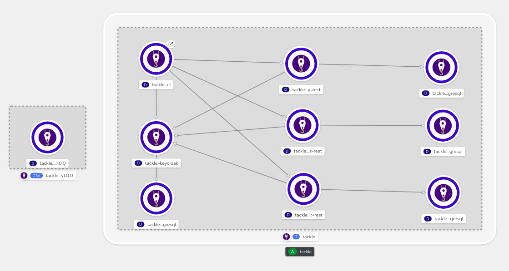

# Moving Tackle Databases between Kubernetes Clusters

 USE AT YOUR OWN RISK - This works but is by no means guaranteed to be release stable or a mechanism supported by the Tackle community.

## Overview

For the time being, there is no export/import or backup/restore mechanism in Tackle (Application Assessment)

If you want to move your assessments, reports, tags, stakeholders, etc to another Kubernetes cluster, a database dump is required.

The [Tackle Operator](https://operatorhub.io/operator/tackle-operator) installs a set of tackle-* component and database pods, which are working together as the "Tackle Application Assessment" - for historical reasons also referred to as "Pathfinder".



To move everything from one Kubernetes instance to another, we need to dump/import the contents of the postgresql DBs, with the exception of the tackle-keycloak-postgresdb database pod.

So, make sure you have the Tackle Operator installed in the target system as well and have it up and running.

**THIS WILL OVERWRITE EVERYTHING YOU HAVE IN YOUR DESTINATION TACKLE PODS**

**NOTE** I'm using `oc` here instead of `kubectl` since this is running on a local Red Hat CRC (Code Ready Containers) installation, but you can replace `oc` with `kubctl` - it just happens that this was "hacked" on CRC, not minishift and I didn't have a `kubectl` CLI pointing at my CRC ready.

## Steps to take

### 1) On the source system (or namespace), get your postgres pods (ignore the keycloak-postgresql)

```
[🎩︎mnagel konveyor]$ oc get pods | grep postgres
tackle-application-inventory-postgresql-5f959df4df-zg46k   1/1     Running   0          15d
tackle-controls-postgresql-6bfd5d57ff-cbnfr                1/1     Running   0          15d
tackle-keycloak-postgresql-9cf6f6879-gbx5w                 1/1     Running   0          15d
tackle-pathfinder-postgresql-5557cb8bff-vgzng              1/1     Running   0          15d
[🎩︎mnagel konveyor]$
```

### 2) (repeat for every pod) get the DB user

```
oc exec tackle-application-inventory-postgresql-5f959df4df-zg46k -- printenv POSTGRES_USER
```

### 3) Export (dump) the database without the flyway tables. 
As opposed to the development instructions in the [README.md](../README.md#db-mgmt), this uses the `--clean --if-exists` flags, and therefore needs to drop the `-a` flag (data only).
The reason is - when installed via the Operator, even an "empty" database (no reports, assessments, tags, etc) already contains some "factory prepopulated" data and an import will fail with contraint violations.
However, with the `--clean --if-exists` flags, `pg_dump` includes all the SQL to drop objects before they are recreated during the import.

```
oc exec tackle-application-inventory-postgresql-5f959df4df-zg46k -- /bin/bash -c "pg_dump --clean --if-exists -T flyway_schema_history -U user-VVU7 application_inventory_db" > $(date +%Y%m%d%H%M%S)_application_inventory_db_data.sql
```

```
oc exec tackle-controls-postgresql-6bfd5d57ff-cbnfr -- /bin/bash -c "pg_dump --clean --if-exists -T flyway_schema_history -U user-fjgo controls_db" > $(date +%Y%m%d%H%M%S)_controls_db_data.sql
```

```
oc exec tackle-pathfinder-postgresql-5557cb8bff-vgzng -- /bin/bash -c "pg_dump --clean --if-exists -T flyway_schema_history -U user-3PsB pathfinder_db" > $(date +%Y%m%d%H%M%S)_pathfinder_db_data.sql
```

### 4) Import
On your target system, import these into the respective database pods and you're done.
```
cat 20210921202637_application_inventory_db_data.sql | oc exec -i tackle-application-inventory-postgresql-5cfcd9b8fc-zjzdt -- psql -U user-VVU7 -d application_inventory_db
```
```
cat 20210921202946_controls_db_data.sql | oc exec -i tackle-controls-postgresql-78bfd667bc-sfckl -- psql -U user-fjgo -d controls_db
```
```
cat 20210921203013_pathfinder_db_data.sql | oc exec -i tackle-pathfinder-postgresql-bbf54879-4g66b -- psql -U user-3PsB -d pathfinder_db
```

It will throw an error (harmless, though) when it tries to drop the `public` schema, because "Flyway" is still there and has a dependency here, but it doesn't matter in this case. 

### 5) You're done! :-) 

